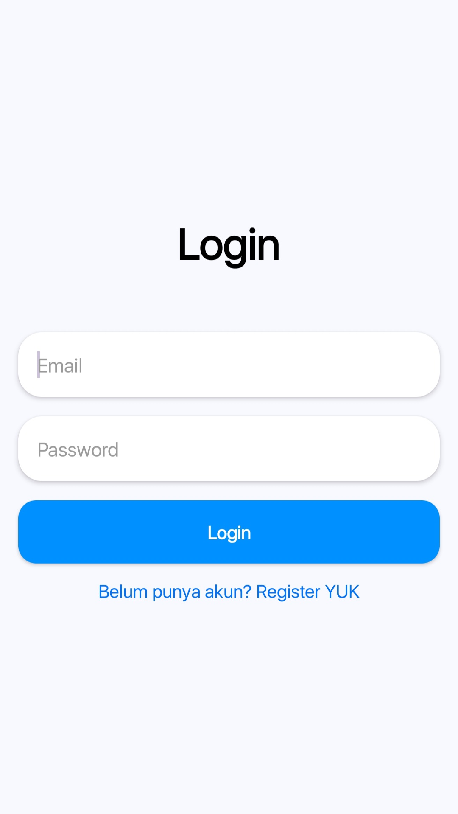
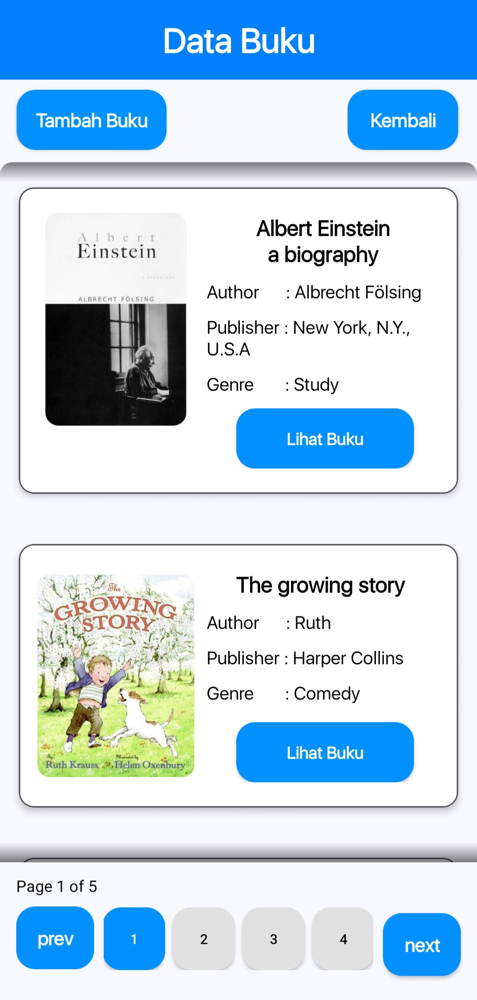
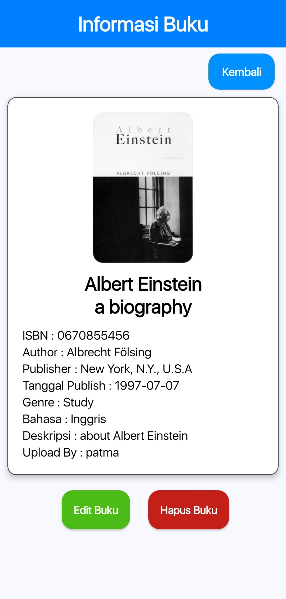
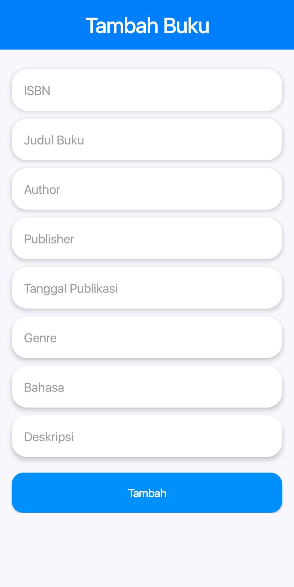
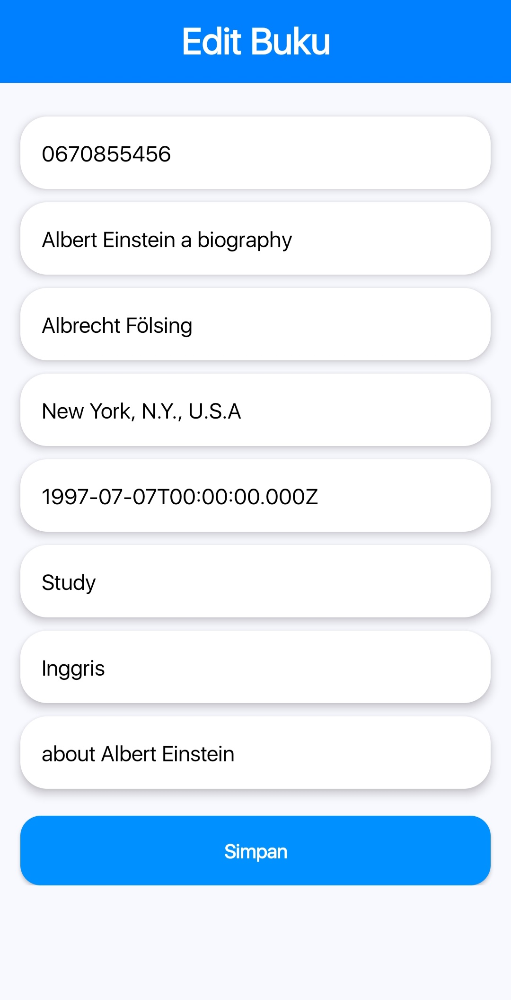

# 📚 Project UKT - Aplikasi Manajemen Buku (Android)

Ini adalah project **Ujian Kenaikan Tingkat (UKT)** dari SMK jurusan **Rekayasa Perangkat Lunak**.  
Aplikasi Android ini dibuat menggunakan **Kotlin** dan berfungsi sebagai sistem manajemen buku yang mencakup fitur login, registrasi, menambah, melihat, mengedit, dan menghapus data buku.

## 🧑‍💻 Fitur Aplikasi

- ✅ Login dan Register user
- 📚 Menampilkan daftar buku
- ➕ Menambahkan buku baru
- ✏️ Mengedit data buku
- ❌ Menghapus buku
- 🔍 Melihat detail buku
- 🌐 Terhubung dengan API untuk komunikasi data

## 🛠️ Teknologi yang Digunakan

- Kotlin (Android)
- Retrofit (untuk API)
- RecyclerView (untuk daftar buku)
- MVVM sederhana
- API berbasis JSON

## 📁 Struktur Project (Ringkasan)

```
📦 src
 ┣ 📂 main
 ┃ ┣ 📂 java/com/example/ukt_geral
 ┃ ┃ ┣ 📂 adapter       -> BookAdapter untuk menampilkan daftar buku
 ┃ ┃ ┣ 📂 api           -> ApiClient & AuthService
 ┃ ┃ ┣ 📂 request       -> Body untuk request API (Login, Register, Buku)
 ┃ ┃ ┣ 📂 response      -> Response model dari API
 ┃ ┃ ┣ 📄 MainActivity.kt
 ┃ ┃ ┣ 📄 LoginActivity.kt
 ┃ ┃ ┣ 📄 RegisterActivity.kt
 ┃ ┃ ┣ 📄 AddBookActivity.kt
 ┃ ┃ ┣ 📄 UpdateBookActivity.kt
 ┃ ┃ ┣ 📄 BookActivity.kt
 ┃ ┃ ┣ 📄 BookInformationActivity.kt
 ┃ ┣ 📂 res/layout       -> Tampilan UI (XML)
 ┃ ┃ ┣ 📄 activity_add_book.xml
 ┃ ┃ ┣ 📄 activity_book.xml
 ┃ ┃ ┣ 📄 activity_book_information.xml
 ┃ ┃ ┣ 📄 activity_login.xml
 ┃ ┃ ┣ 📄 activity_main.xml
 ┃ ┃ ┣ 📄 activity_register.xml
 ┃ ┃ ┣ 📄 activity_update_book.xml
 ┃ ┃ ┣ 📄 item_book.xml
 ┃ ┣ 📄 AndroidManifest.xml
```

## 📷 Screenshot

### 🖼️ Halaman Register


### 🖼️ Halaman login


### 🖼️ Halaman Utama


### 📚 Daftar Buku


### 🔍 Detail Buku


### ➕ Tambah Buku


### 🖋️ Edit Buku

